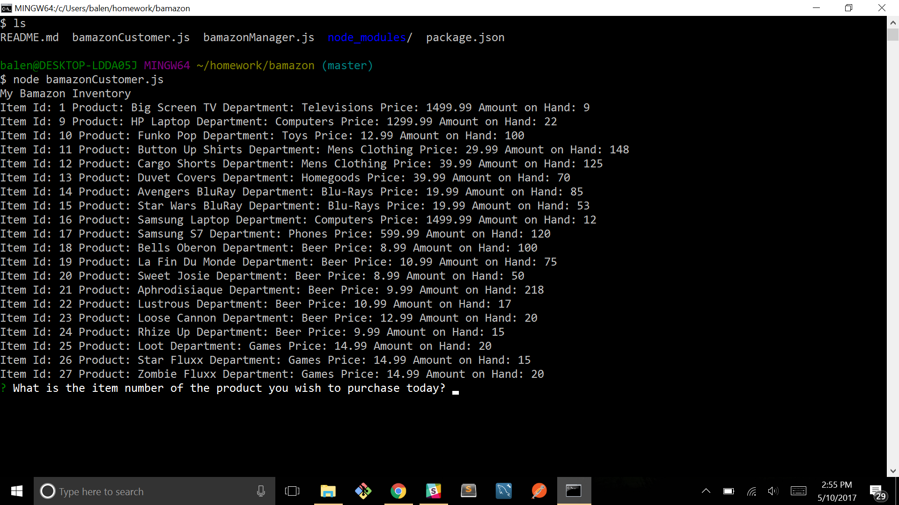
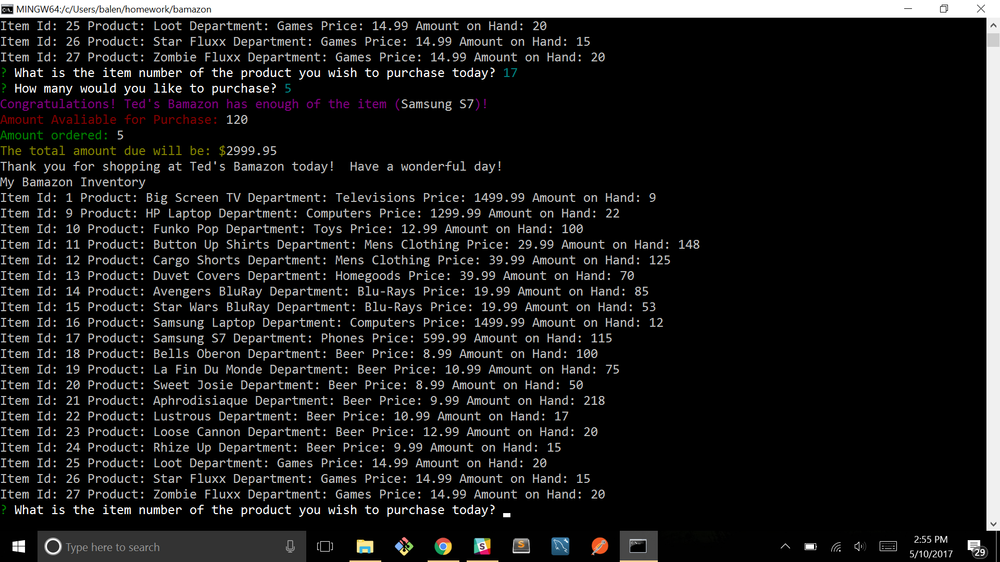
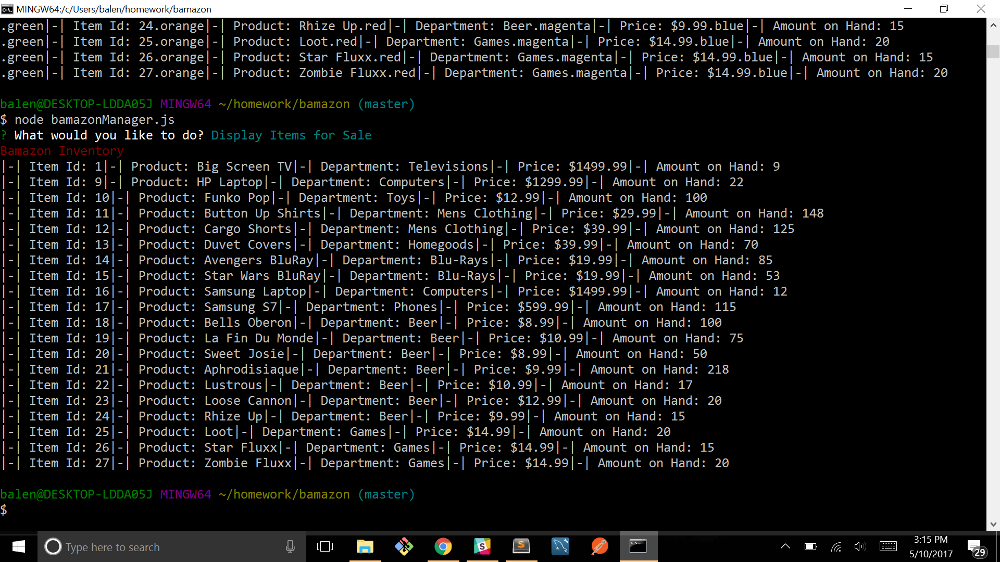
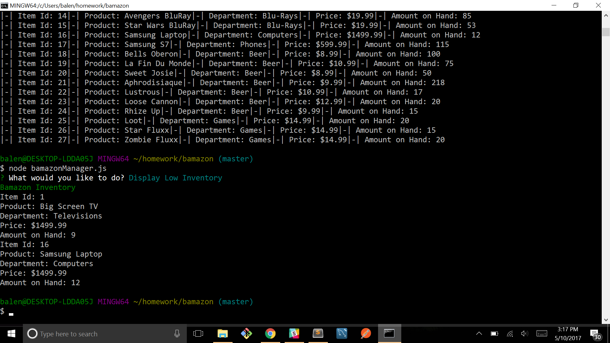
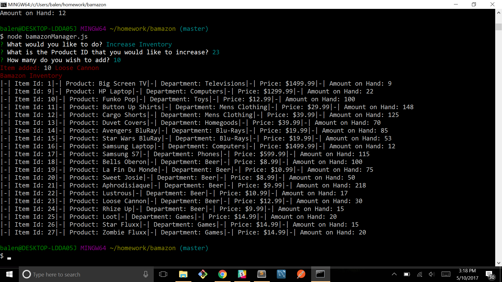
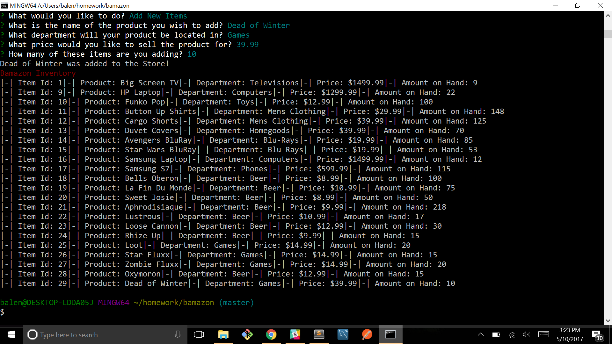

# Bamazon

This is a Node.js App using MySQL that is an Amazon like store front.  
The first app, called bamazonCustomer.js will bring up the current inventory, taken from our database via MySQL.

Using Inquirer, it will ask you which Item number you wish to purchase and how many you want to purchase.  When you answer, it will give you a total and update the current quantities and give you your total price.  It will then restart the purchase process.

The second app, called bamazonManager.js will use Inquirer to bring up 4 options.  

The first option will let you see a current list of all items for sale.

The second option will display items that are currently in short supply, IE less than 15 total.

The third option will let you increase the amount of your inventory on hand.  You choose an item, and it will update the database and then show updated inventory.

The final option will let you add a new item to the database.  You will be asked the name, department, price and quantity.  It will then add it to the database and then show the current inventory.

I also used the Colors library to add a little color to it.  
